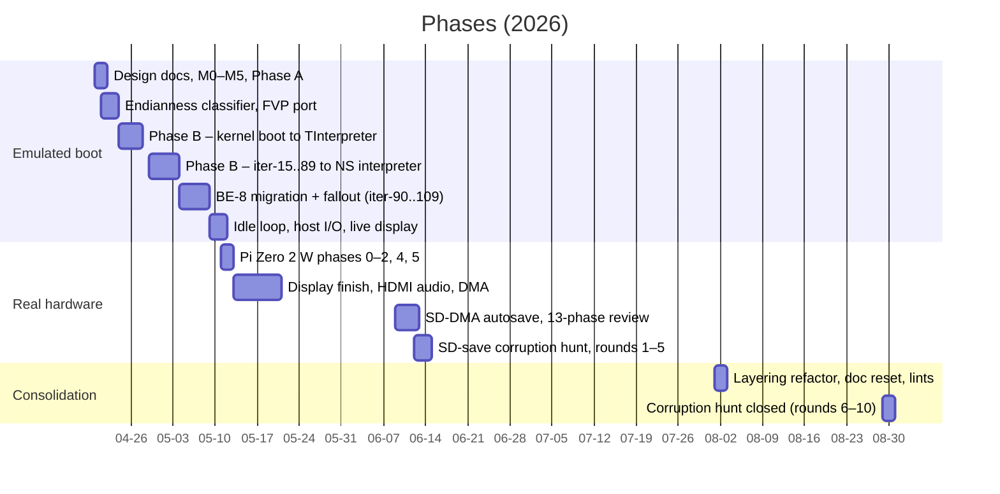
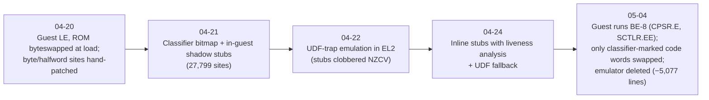

# Project history — how the Newton hypervisor was built

A timeline of the `baremetal/` project reconstructed from the commit
history (525 commits under `baremetal/` plus the three root design-doc
commits, 2026-04-20 → 2026-08-02) and from the versions of `PLAN.md`,
`INVESTIGATION.md`, `HANDOFF.md`, `docs/plans/*` and the review reports
that existed at each point. Hashes are `command git` short hashes.
This is a record of *how the work went*, not of the current design —
for that read `HIGHLEVEL.md` and `IMPLEMENTATION.md`.

## At a glance

| | |
|---|---|
| Calendar span | 2026-04-20 → 2026-08-30 (36 working days in five bursts) |
| Commits | 525 in `baremetal/` (31 authored "Claude" in a Linux sandbox on day 1, the rest as "Walter Smith" from the user's Mac); 13 are PLAN.md-only |
| Busiest days | 04-29 (51 commits), 04-20 (49), 05-12 (36), 04-27 (35) |
| Rust source | 11.9 k lines after 4 days → 33.8 k (05-03) → 26.0 k after the BE-8 migration (05-08) → 38.4 k at the end |
| Guest tests | 4 → 22 (04-23) → 36 (04-28) → 35 (05-07) → 38 (06-12) |
| Numbered iterations | `iter-15` … `iter-109` (04-29 → 05-06), one PLAN.md retrospective each |
| Hosts | QEMU `raspi3b` from day 1, ARM FVP from day 4, Pi Zero 2 W from 05-11 |

## 1. Day one: design, milestones, and the first reset (04-20)

- **Design docs** (`b5e17721`, `9ae8eca0`, `7f826a13`). A Type-1 EL2
  hypervisor for the Pi Zero 2 W running the ROM at EL1/EL0 AArch32 with
  hardware stage-1 walks of Newton's own page tables. The plan assumed
  **reusing Einstein's C++ peripheral classes via FFI** (`cxx-core/`,
  CMake, hand-rolled C ABI) and listed 15 open questions to verify
  empirically. QEMU `raspi3b` chosen as the dev target.
- **Einstein as oracle** (`c614b378`, `2966a379`). Before writing the
  hypervisor proper, a headless `NewtonProbe` CMake target reusing
  Einstein's emulator core boots the 717006 ROM and dumps page tables and
  counters. It answered the open questions the same day: only
  section/64 KiB/4 KiB descriptors (no tiny pages, three fine-table
  placeholders), exactly 15 CP15 tuples, 405,810 SWPs all from one PC,
  DACR always `0x00055555`. The probe stayed the cross-reference tool for
  the whole project, growing task census, heap dumps, trace output in the
  hypervisor's log format, and later a NewtonScript bytecode tracer.
- **M0 → M5 in one day**: banner (`416f5997`), EL2 MMU/ERET-to-AArch32
  (`3d7ae8ba`), stage-2 + data-abort round trip (`7aca694b`), real ROM at
  PC=0 (`3a5339b2`), MMIO/CP15 trap shims (`3a330c50`), ROM-load rewrite
  of 71 lax StrongARM CP15 encodings (`35298d0f`), descriptor
  normalisation on first TTBR write killing a 38 k/s prefetch-abort storm
  (`101500c3`), vIRQ/vFIQ (`e13b176e`).
- **First direction change — pure Rust** (`3df141c2`). The C++ FFI core
  was built and deleted the same day ("not worth it for 30–60 lines of
  real logic per peripheral"). Einstein became a *reading reference*;
  `docs/peripherals.md` is the spec each Rust port is written against.
  The same commit added the ARM-guest test framework (HVC pass/fail
  protocol).
- **Second direction change — "stop the hacks"** (`d63d5412`). `HANDOFF.md`
  (`ae4d22f2`) admitted too many tokens had gone into "pattern-matching
  against the boot log and doing speculative stubs". The user's
  direction became the Phase A plan: six *real* handlers (fine-table
  rewrite, EL2 UND via guest-side trampoline, serial, CP10/11, screen
  blit, DFSR/DFAR), each its own commit plus guest test, ROM untouched;
  then Phase B = boot and fix stalls one at a time. Midterm goal: reach
  the `TInterpreter` constructor.
- **Trip-wire doctrine** (`49061590`): every unknown MMIO/CP15/UND case
  halts loudly with a context dump. Enforced for the rest of the project
  and later written into `CLAUDE.md` as "never silence a loud halt".
- **First real kernel bug** (`5fddb693`): `MCR c7,c7,0` (FlushTheCache)
  is UNDEFINED on A53, the UND trampoline pushed on an uninitialised
  `SP_und`, and the save slot sat inside the kernel L1 table. Diagnosed
  with a RAM-resident AArch32 stub because QEMU returns 0 for banked-MRS
  from EL2 (`a5bfda8f`).

## 2. Endianness, classifier, FVP (04-21 → 04-23)

- **Phase A closeout audit** (`999ad184`, `97d9b4c2`): three
  Explore-subagent reports diffed into a tiered todo; found Einstein's
  `TJITGenericROMPatch` word patches missing "by oversight". A second
  audit re-verified all ten items. `WORKFLOW.md` later records
  "finish-the-phase semantics": tiers are ordering, not permission to
  defer.
- **The REx-never-found hunt** (`43e74530` → `1459f1c8`): tracer + gGlobals
  dump vs Einstein showed `STRH #0,[gGlobals,#0x20]` cleared the wrong
  halfword — the ROM is BE-32 word-invariant, the host is LE. Every ROM
  byte/halfword access had to be patched. This produced the
  **endianness-patch classifier** (`79a74292`): an execute-time oracle
  bitmap from Einstein's JIT (2,155 sites) checked as a subset of a
  static recursive-descent walker (77,972), a symbol ruleset partitioning
  31 k symbols into code/data, and a ROM hash so a stale bitmap halts.
  `1459f1c8` patched 27,799 sites pre-boot with "shadow stubs".
- **QEMU `msr spsr_el2` clobbers `SPSR_svc`** (`714a0113`): the kernel's
  `movs pc,lr` stayed in SVC and popped at a guard page. Isolated by
  comparing HVC/DABT vs UND round trips; worked around by ERETing into an
  in-guest `movs pc,lr` stub. `docs/QEMU_BUGS.md` created. The same
  commit replaced in-guest shadow stubs (which clobbered NZCV before a
  `STRBEQ`) with **UDF-trap emulation** in EL2 after four in-place fixes
  were rejected.
- **Tooling burst** (04-22): first-touch and every-call trampoline
  tracers (`f99b0f24`, `8ce1b233` — "no first-word prologue heuristic",
  per the user), PowerOffAndReboot / Reboot / BootOS canaries via HVC,
  hypervisor-side gdb guest breakpoints (`66927298`), ROM disassembler
  with 52,335 symbols (`b2acf41a`), guest `putc` → UART giving the first
  ROM text ("Unhandled exception evt.ex.moncall, warm reboot!").
- **FVP port** (`e66eeebc` → `a23d0f2d`, 04-23): platform abstraction, EL3
  stub for GICv3, then a run of bugs QEMU's cache model had hidden
  (`HCR_EL2.DC=1` disabling guest stage-1, DC/IC ordering, un-cleaned L2
  rewrites, TTBR walk attributes, FPA `rfc/wfc` false-condition UND, SWP
  VA→PA). The **both-platforms-green rule** dates from here. FVP's tarmac
  trace root-caused the `MakeObject` soft reset (`ef86a91b`).

## 3. Phase B: kernel boot to TInterpreter (04-24 → 04-28)

Boot depth went 26.9 k → 156 k → 230 k → 403 k trace events → TInterpreter
plus 27 kernel tasks idle. Tests 23 → 36.

- **Inline shadow stubs with liveness analysis** (`cd7b8253`, `ee96f638`):
  CFG-aware dead-register selection for a 7–12 word inline byte-access
  stub; seven analyser fixes, each found by one boot wedge decoding to a
  clobbered register. Two more liveness bugs (`91fdb2e5`, `8649628f`).
- **Banked-register audit** (`48da9db9`, 04-25): per ARM ARM Table D1-79,
  `ctx.x[13]/x[14]` are always `SP_usr`/`LR_usr`; `mrs sp_el1/elr_el1`
  do *not* give the SVC registers. A prior "QEMU bug" entry was retracted
  as a misdiagnosis. This bug class recurred in June (`ctx_blit_mode`
  reading `SP_usr`) and `CLAUDE.md` now says "banked registers are not a
  QEMU bug".
- **task_dump + STRUCTURES.md** (`866920fa`, `05c7579d`): walks
  gScheduler run queues and all tasks via gObjectTable; mirrored into
  NewtonProbe for side-by-side census. `docs/STRUCTURES.md` grew
  +1,278 lines this week and carries an "always extend" rule.
- **STKU wedge** (`9988eae7`): FVP showed it was QEMU-only; root cause was
  `set_return` writing `SPSR_EL2` directly (which QEMU leaks into
  `SPSR_svc`) ~1,300 times inside SVC handlers.
- **"newt" DABT** (04-24 → 04-26, ~15 commits): a store of the ASCII
  "newt" landed on another task's stack. A 170 k-event trace diff against
  Einstein found a *missing* stack fault; a full "ScratchVA" stub variant
  was planned (`docs/plans/shadow-stub-scratch-va.md`), built, and
  exonerated. The **key discovery** (`1011eb74`): the kernel packs four
  stacks per 4 KiB page using ARMv4 *subpage AP* with no-access guard
  subpages; ARMv7 has no subpage AP, so the hypervisor's descriptor
  flattening removed every stack guard. Fix, from the user's insight: a
  ROM patch forcing per-page stack allocation in
  `TStackManager::ResolveFault` (`043ed995`). Boot 170 k → 403 k.
- **TInterpreter reached** (`72dd7bdd`, 04-26), immediately wedged inside
  it by `L1[0xCD]=0x90`. An investigation plan (`8bfd26a8`) and ten HVC
  probes along the fault chain, plus Einstein recovering the identical
  abort, led to (`fed61184`): ARMv7 leaves `DFSR.Domain` unknown for
  DFSC=5 where StrongARM supplied it. Fix overlays the L1 domain into
  `DFSR_EL1[7:4]`.
- **"Unknown bank #5" silent zero** (`dfc43fd4`): an IPA the ROM reads
  that Einstein silently zeroes (`TMemory.cpp:1026`). "Phase B done"
  (`0bac6601`) with 27 tasks idle; PLAN.md rewritten, INVESTIGATION.md
  collapsed.
- **RelocHeap corruption** (04-27, ~20 commits in a day): two commits
  concluded "QEMU stage-2 enforcement bug"; **FVP reproduced it
  byte-for-byte**. Two symptom workarounds advanced boot ~2,400 lines and
  were **reverted the same day** ("project goal is running the original
  ROM unmodified"). Root cause: subpage AP again — heap #3 shared a PA
  with two task stacks. Two ROM patches force VM heaps to whole 4 KiB
  chunks (`4b6e4c1e`).
- **Zero-alias directive** (`72cd36e2`, 04-28): the user stopped wedge
  chasing until RAM PA aliases were zero. Two ROM-patch attempts
  (36 KiB stack slots, call-site pad) wedged and were reverted — one
  because of a hand-computed imm12; the assembler round-trip rule
  entered `WORKFLOW.md`/`CLAUDE.md`. A six-probe ladder to
  `PrimRememberMapping`/`PrimForgetMapping`/`TTask::Init` and a mechanical
  kernel-intent mask tracker proved all 15 aliases subpage-disjoint by
  design. A `__nw__` probe then showed 293 overlapping live heap blocks —
  the user's "allocator chaos" hypothesis.

## 4. Phase B: iter-15 to iter-89 (04-29 → 05-03)

Every iteration adds a PLAN.md retrospective (findings, falsified
hypotheses, next plan); from iter-46 an auto-prune rule keeps only the
last one or two ("history lives in git log"; `38c2cbc7` cut PLAN.md
5,787 → 335 lines). 51 commits on 04-29 alone.

- **alrt CList corruption closed** (`f853fd17`): `pa_emulate.rs` (stage-2
  RO trap + AArch32 store emulator) caught `SetFreeChain`'s prologue push
  crossing a subpage boundary. A hypervisor-side PA-splitting "Option β"
  (`shadow_pool.rs`) was built; the **user ruled hypervisor-side
  compensation off the table** (`6a625118`) — the fix must be a kernel
  patch. 36 KiB stack slots with a full-page guard landed after one
  reverted attempt (`#33792` appears ~50× in the ROM).
- **WriteRun count corruption** (iter-15..29, 15 commits, one day): four
  hypotheses falsified in order; discovered that probes "setting flags"
  via the UND save slot were no-ops. Verdict: instrumentation artifact.
  iter-30 (`37b50e93`) is an explicit course correction — stop microscope
  probing, assert the Phase-B invariants directly (`halt_invariant`).
- **Shadow-stub scratch-register bugs**, three of a kind: R14 picked
  across a tail call (iter-42), R12 picked because the liveness analyser
  read HVC-*patched* ROM (iter-49/50, fixed with an original-instruction
  side table), R12 picked inside FPA helpers whose private convention
  keeps `ip` (iter-85, `68d29826`).
- **iter-55: first boot that does not end on a halt**; iter-56
  (`806c5e1d`): **framebuffer renders correctly** (BE-32 byte lane,
  `src_pa ^ 3`). Performance triad on 04-30: lazy in-ROM ROR stubs
  (3.4 M → 91 k traps/s), cache-by-VA run natively, AArch32 fast-forward
  DABT trampoline → **scheduler/multitasking**, then **splash idle with
  26 tasks** (`a6b01296`).
- **Splash wedge** (iter-65..69, two days): three PLAN.md-only
  falsifications, then (`4f8cc283`) the classifier had marked a
  literal-pool function pointer as a byte access; the stub overwrote it
  with a UDF marker and the ROM jumped to it. The user's "shadow_stub is
  broken" hunch was right. Drove the iter-70..72 walker overhaul (jump
  tables, fn-pointer literals, dropping backwards inference after user
  pushback); oracle⊆static violations 12 → 0.
- **NewtonScript comes up**: FPA UNDs forwarded to the kernel's own FPE
  (iter-73), `newton-objects` no_std parser + `romdump` (`b6065c9d`),
  `rep_print.rs` hooking the `POutTranslator` vtable with a printf
  interpreter (iter-79/80). A two-day `GetSoup` → NIL chase (iter-74..82)
  ended in a one-liner: the BE→LE byte swizzle was gated on an address
  heuristic that missed flash reads through the PCMCIA aperture.
- iter-86: semihost-loaded test binaries, `run-all.sh` 5 min → 6.7 s.
  iter-87: kernel-patch stubs sat inside the UND-trampoline window; arena
  allocator + reserved scratch slots.
- **iter-89** ends the slice on `evt.ex.fr.store(-48022)` during package
  install — a soup-index Delete of a never-inserted key — which exposed an
  open-ended class of "byte-access PC missing from the bitmap" bugs.

## 5. The BE-8 migration and its fallout (05-04 → 05-08)

- **The plan** (`6fd4536c`, 654 lines): "option B" for the iter-89 bug
  class. With a now-reliable code/data partition, run the guest big-endian
  and let the CPU place byte lanes — eliminating bitmap-sync bugs and
  ~27.6 k UDF traps per boot. Executed as phases 0–4, each its own
  commit, "in a fresh context": probe sweep (−7,000 lines), identity
  accessor refactor (~120 sites), atomic flip (`9e9d9bc9`, ~862 k code
  words swapped), docs, cleanup.
- **Fallout chain** (iters 91–104, ~12 wedges in two days), almost all
  fixed by classifier seeders not runtime handlers: literal pools marked
  as code; the EL2 page-table walker reading RAM raw-LE (it had been
  corrupting L1 with byteswapped "section" false positives); 16,920
  patch-table thunks unmarked; kernel fault handlers `LDR`ing the faulting
  instruction as data (every SWI had dispatched to the wrong handler);
  FPE prelude. A first VA-aware walker regressed (reach 880 k → 3.3 M)
  and was backed out, then redone properly (`ee7fdef7`: "the actual fix
  the user has been asking for the entire time").
- **iter-105** (05-05 → 05-06, ~15 commits): a task's first user
  instruction landed at PC=0 in Thumb. Every runtime layer was ruled out
  (save areas, pre-ERET state, emulated ERET, SPSR drift, SCTLR.TE).
  **FVP tarmac** showed the fetch returning byteswapped bytes; the
  BE-aware diagnostic reader had been masking it. Cause: a REx stub
  reached only via a package relocation slot. Fix: seed from the loader's
  own relocation tables (`31d31d6b`). This produced the `CLAUDE.md`
  **bitmap-first triage** rule.
- **iter-108** (`ab8d8161`): kernel idles with 26 tasks (oracle 27) —
  "Phase B essentially complete". `HvcImm` enum after an HVC immediate
  collision had silently broken the tracer (`278147cf`).
- **gLocaleCache NULL at 0xeccac** (`934afc38`, 05-06; then `1f91fb1f`,
  05-08): two independent causes. PCMCIA slots 2/3 chip-detect succeeded,
  so socket 3 registered interrupt bit 14 and wrote past a 13-entry
  handler array into `gLocaleCache`. Then an Einstein-side NS bytecode
  tracer (`probe/trace.cpp`, mirroring `ns_trace`) diffed ~9,200 REP
  lines and found the serial-number bitstream was built for NewtonID
  `{0,0}`, sending NS boot down a `SetLocale` branch before the cache
  existed. The `934afc38` commit also deleted the 1,565-line
  INVESTIGATION.md and `docs/phase-a-audit/`, and recorded a lesson:
  "Attempt B" of a ResolveFault wrapper rendered the splash *only because*
  it masked wild-FAR bus errors.
- **Shadow-stub emulator deleted** (`48333b80`, −5,077 lines); tests
  36 → 35. A `blt` off-by-one in a hand-encoded wrapper — it had been a
  pass-through for weeks — was found by exit probes + assembler
  round-trip (`37dfcf1f`); replaced by a coherent TStackManager
  geometry patch set (`0f6ab6b0`).
- **Comments vs source** (`ee443475` … `3fcce170`): a code-against-code
  audit of vic/mmio/flash against `TMemory.cpp`/`TFlash.cpp` found
  several behaviours derived from *comments claiming* Einstein behaviour
  that Einstein does not have.

## 6. Idle loop, live display, and the real Pi (05-09 → 05-20)

- **NS time-base overflow in 2026** (`c6493bb7`): Einstein's 1993→2008
  shift keeps the 30-bit NS clock positive only until ~2025; past that
  `SetSysAlarm` computes an alarm in the past and the kernel IRQ-loops.
  Worked around with a 6-year RTC backshift.
- **LocalTalk FIQ runaway** (`6e25c6da`): the DMA stub raised the
  completion IRQ on every enable write; the FIQ handler re-armed itself.
  A per-channel TX/RX state machine mirroring Einstein completed boot to
  the **Welcome UI**.
- **Live display + pen** via a semihost `host_io` bridge and a
  `tools/host-viewer` crate (`7c5cc968`); persistent flash file;
  `trap_hist` top-K histograms found the idle spin in `PauseSystem`
  returning immediately — EL2 `wfi` cut 240,571 → 3,863 traps per 2 s
  (`1cf0ddc5`). Four stale guest breakpoints had silently disabled
  snapshot autosave for weeks (`fec25ea3`).
- **Hardware plan** (`7b1fbd48`, 05-11): HIGHLEVEL §11 rewritten — Zero 2 W
  is the sole silicon target, no Pi 3B stepping stone; FVP promoted to
  co-primary. `docs/REAL_HW_BRINGUP.md` phases 0 (EL2 + UART), 1 (full
  hypervisor), 2 (SD FAT32), 3 (snapshot ring, deferred), 4 (HDMI),
  5 (USB touch), 6 (audio/serial/PCMCIA). Same day, the "Phase A/B"
  labels were stripped from the docs (`cdee21b7`).
- **Phase 0/1 same day**: first flash halted silently until `gpu_mem=16`
  selected `start_cd.elf`; `CurrentEL=2` confirmed; the ROM boots on the
  Zero identically to QEMU (CNTFRQ 19.2 MHz vs QEMU's 62.5).
- **05-12, 34 commits**: SDHOST driver from Circle + Linux (four hardware
  round-trips to first read — the data-IRQ enable gates the FSM even in
  polled mode; clock was never the problem), `flash-persist-sd`
  (3 min → ~0.8 s bus time at 25 MHz/4-bit), VC framebuffer (flicker
  root-caused to a degenerate 512-byte alloc from unbatched mailbox tags;
  a persistent 16 px firmware white bar never cleared, offset instead),
  polled DWC2 host + HID + MTouch driver planned in `docs/MTOUCH.md` and
  closed the same day (six round-trips: `HCDMA` needs `|0xC0000000`,
  manual DATA0/1 toggle, Newton keys on pressure exactly 4).
- **Hardware-only bug** (`c5d3e26e`, 05-13): the calculator showed garbage
  on the Zero only — ARMv8 executes conditional coprocessor instructions
  unconditionally; three FPA sites; cond-skip emulated in `handle_und`.
  QEMU honours ARMv4 semantics so it was invisible in emulation.
- **HDMI audio** (`6ca23629` 05-16 → `ade32609` 05-20): the planned
  PCM/I2S path was wrong (reaches only GPIO 18–21); VC4 MAI at
  `0x3F902000` instead. Three hardware rounds: a 1 Hz click from UART
  busy-wait starving the FIFO → DMA-driven PL011 TX; panel reboot on
  stream stop → never toggle `MAI_CTL.ENABLE`; `sndm` wedge at 90 Hz →
  edge-triggered watermark IRQ; DMA cyclic ring replacing the polling pump
  (`d4d5bb7a`) with three Linux-equivalence docs. Remaining defect:
  198–220 ms gaps every 2 s — the flash autosave busy-waiting the SD card
  inside `trap_irq`. The 05-20 commit hands the design choice back to the
  user rather than picking one.

## 7. SD-DMA autosave, the stabilization review, and the open bug (06-09 → 06-14)

- **EL2 interrupt handling** (`88db3a8c`): `trap_irq` dispatches on
  `SPSR_EL2.M`; a scoped `with_irqs_unmasked` replaces nine cooperative
  poll sites. Commit notes it was implemented by a subagent from a written
  plan and independently re-verified. Interrupt-driven USB fixed inking
  strokes breaking into segments (`c4af8f24`).
- **SD-DMA autosave** in four milestones on 06-10 (`2730381d` →
  `b78e33c0`): DREQ 13 confirmed from the Linux DT, vendored
  `embedded-sdmmc`, per-cluster LBA map (the card file is fragmented),
  CMD25 multi-block DMA with an IRQ-driven save state machine.
- **"Document final state, drop process history"** (`65efeee5`): the goal
  declared reached; README/PLAN/HIGHLEVEL rewritten, the 1,160-line
  bring-up diary reduced to a reference, `docs/plans/` deleted.
- **Scaffolding teardown exposes a latent bug** (`4bc24fca`): deleting
  Phase-B capture probes hung the Pi deterministically — their
  side-effect `TLBI VMALLE1IS` had been bounding stale guest TLB entries
  (the hypervisor rewrites guest PTEs with no TLBI). Fix: one `vmalle1`
  per 16 ms heartbeat.
- **Stabilization review** (`d03193ae`, 06-11): six parallel reviewer
  agents (trap/emulation, memory/MMU/snapshot, peripherals, host,
  diagnostics, architecture) → a 646-line 13-phase plan "covering every
  finding — no deferrals", each phase one agent, one commit, coordinator
  review before the next. **All 13 landed the same day.** Verdict:
  architecture sound; "a handful of real latent bugs, a thick layer of
  Phase-B residue compiled into hot paths (one piece quietly
  load-bearing), and comment/doc drift". Headline finding: the
  `irq_from_guest` "wedge probe" was the *de facto* sound-completion
  model on null-audio builds. Notable fixes: conditional BL/SVC treated
  as unconditional by the liveness analyser; `ctx_blit_mode` reading the
  wrong banked SP; BE-8 sub-word MMIO reads returning the wrong lane;
  mailbox buffer alignment (a VC reply could be clobbered by a shared
  dirty cache line); `install_patch` verifying the original word and
  halting on mismatch instead of "silent ERROR — skipping"; `trap.rs`
  (4,400 lines) split into six files with all 59 functions diffed
  verbatim; the FVP guest-test loader found silently broken; tests → 37;
  `SNAPSHOT_RESUME_CONTRACT.md` and `PACKAGE_NATIVE_CODE.md` written.
- **06-12**: loud halts had been *invisible* on hardware (dump stuck in
  the DMA console ring) — `halt()` now drains it (`91b8a329`). A NULL
  free-list store through VA 0 onto ROM page 0 was absorbed as a ROM
  write (`fdf78822`, tests → 38) — in hindsight the first symptom of the
  bug below. Two WIP commits made the initial full save ~0.8 s and
  refactored the CMD12 wait.
- **SD-save corruption hunt** (`INVESTIGATION.md`, ten rounds in the
  end — §9 closes it): ~1-in-5 Pi boots the Newton store walks a wild pointer, only with
  the *concurrent background* save on. R1 (nested-IRQ ELR/SPSR
  mis-restore) and R2 (banked-GPR clobber) were refuted by tripwires that
  never fired. R3, the user's reframing — the SD round-trip garbles the
  image — was disproved by way-out/way-in checksums. R4 found a boot
  crashing *before its own first save*, hence a "torn snapshot" of a
  pointer-rich store mid-DMA; staging a consistent copy at save start did
  not close it (R5, reconstructed from prompt history after the session
  transcript was lost). Parked with the background save off ("stable,
  unshippable — blocks audio") under the user's standing constraint: "We
  don't implement fragile code and then just try to avoid triggering it."
  R6/R7 (08-29) bisected at the pre-DMA commit in a worktree (0 in 20
  boots) and reproduced the June signature on the current tree at boot 9,
  caught by the wrong tripwire; a bus-error canary was added for the next
  batch.

## 8. Consolidation (08-01 → 08-02)

- **Layering refactor**, phases 0–9, one commit each, gated on the build
  matrix, 38 tests, and QEMU/FVP cold-boot milestone diffs against a
  phase-0 baseline log: flat `src/` → `arch/hv/newton/peripherals/host/
  diag` with a **shrink-only import allowlist** (54 → 46 → 37 → 17 → 13 →
  0); `hv::layout` manifest; layout-driven MMIO router; fn-pointer backend
  seams; `diag` behind `nh_diag` (−885 KiB image); a `GuestOs` trait as
  the single hv→newton edge; per-ROM constants under `rom-717006` with a
  51-entry ROM-address allowlist and a `rom-710031` skeleton.
- **Doc and comment reset**: full comment audit dropping past-tense
  narrative (`4e4b122d`); the user's own rename "shadow-stub → inline
  patch — Claude came up with the 'shadow stub' name, but it never made
  sense to me" (`7784c9dd`); top-level docs rewritten as a current-state
  snapshot and `docs/review-2026-06/` deleted since everything in it was
  implemented (`22ddec21`); `CLAUDE.md` 425 lines → doctrine + doc index
  with a new `docs/DEBUGGING.md` (`ebdfcab0`).
- **Lints against drift**: `check-doc-symbols.py` requires every
  module-qualified code reference in docs to resolve to that module — an April namespace
  rename had "laundered stale text into apparent currency"; the lint was
  extended to source comments (25 hits, 7 real). The classifier oracle
  had been silently writing to `baremetal/baremetal/classify/`
  (`463dca3c`). The byte-access oracle and static bitmap were removed —
  they validated a mechanism deleted in May (`77cec03d`).

## 9. The corruption hunt closes: a TLB stale under `HCR_EL2.DC` (08-29 → 08-30)

The June corruption hunt (§7) resumed on the refactored tree and
closed in two days. The hunt log — `INVESTIGATION.md`, 1,540 lines
and ten rounds by the end, never committed — was distilled into
`HIGHLEVEL.md` §4.4, `PLAN.md` and this section, then deleted.

- **The harness that made it tractable.** The Pi sits on a HomeKit
  switch; `pi-upload.py --no-upload` power-cycles it (verifying the
  bootcode banner actually reappeared), captures the serial log, and a
  shell loop judges each boot's slice by markers. Dozens of unattended
  cold boots per batch — ~200 across the hunt — turned a ~1-in-5
  intermittent into measured rates and, later, a fix into a
  statistical verdict. A stress knob (autosave gate 2 s → 100 ms,
  dirtying a rotating pair of blocks every tick) raised per-boot
  exposure ~20×. A notify probe printing every on-screen error dialog
  to serial closed the "boot looks clean but a dialog is up" gap.
- **Rounds 6–7 — it needs this tree.** A worktree at the pre-DMA
  commit ran 20 boots with zero hits; the current tree with the
  background save on reproduced the June null-store signature. So not
  a latent ROM bug any build trips over — something in the tree's own
  window.
- **Round 8 — the mechanism, one level up.** Heap-invariant probes at
  the kernel C-heap allocator entries caught the corruption at its
  source: a free block's header overwritten by three NewtonScript
  Refs, byte-identical across hits — and four distinct exits
  (null store, busError, `Reboot(-10075)`, a sound-channel storm) all
  downstream of the same few-seconds window after the welcome UI.
- **Round 9 — one physical page, two VAs.** A stage-2 write watch on
  the overwritten page caught the writer red-handed: a precedent-stack
  push at a *different VA* landing on the C heap's physical page; a
  page-table walk confirmed both stage-1 translations pointing at the
  same PA. A page-grant audit (probes on the kernel's Remember/Forget
  mapping SWIs with an EL2-side PA→VA table) then showed the kernel's
  own mapper failing `-10006` while every table EL2 could read was
  sane — the kernel was acting on state EL2 didn't see.
- **Round 10 — the cause.** The kernel does every "physical" access —
  page-table reads and writes above all — by turning its stage-1 MMU
  off and on around the access (`LoadFromPhysAddress` /
  `StoreToPhysAddress`); EL2 toggles `HCR_EL2.DC` at both edges so
  the MMU-off access stays cacheable. The L1-write ring proved the
  kernel loading garbage from 45 consecutive L1 words whose real
  contents were sane, and a window audit comparing each MMU-off read
  with EL2's own read of the PA caught it directly: with `M=0, DC=1`
  the load of PA `0x04001000` returned `ROM[0x1000]` — translated
  through the kernel's VA mapping instead of flat-mapped. Per
  DDI 0487, `HCR_EL2.DC` "is permitted to be cached in a TLB", so
  toggling it demands TLB maintenance; without it a stale stage-1
  entry serves the MMU-off "physical" access. Every symptom of rounds
  3–9 — descriptors written into data pages, data read back as
  descriptors, the double-mapped page — is downstream of that, timing-
  dependent because the stale entry must survive until the next
  window (the background save's traps and IRQs reshuffle what the TLB
  holds). QEMU does not cache DC in a TLB, which is why emulation
  never reproduced it.
- **Fix and validation.** `TLBI VMALLE1; DSB ISH; ISB` after every DC
  change (`hv::guest::set_dc_for_stage1_off`). 39 of 39 automated
  stress cold boots clean, where the same configuration had failed
  every 1–10 boots. The rule is doctrine in `HIGHLEVEL.md` §4.4.
- Net of the hunt besides the fix: five refuted theories (nested-IRQ
  ELR/SPSR restore, banked-GPR clobber, SD round-trip garbling, the
  completion-IRQ path, DMA writing RAM — the SD byte path was proved
  *byte-faithful* by way-out/way-in checksums), and two keepers found
  along the way: the save-staging snapshot (a real torn-snapshot bug,
  fixed in June) and the `WaitBusy` refactor that removed the last
  in-IRQ busy-wait. The background save ships unconditionally on.

## 10. The video-path phases and the quadratic animation (08-30)

The written five-phase video plan was executed by one subagent per
phase (measurement loop, `screen::blit` fast path, VC-scaled 1:1
surface, dirty-rect coalescing, rotation plumbing), each hardware-
validated against a digitizer+serial-tap benchmark built in Phase 1.
EL2 paint cost fell ~20-50x per layer — and the original complaint
(a full-width window opening over several seconds, per-frame time
growing quadratically) did not move at all. The wrap-up's "the
latency sits guest-side between blits" conclusion survived less than
an hour of contact with the user: a new per-window masked-EL2-time
metric (accumulated through the existing stall-stretch guards and
printed by the trap-hist dump) showed 97-99% of wall time inside the
HVC Align path, ~45 us per alignment fault. Of that, ~41 us was
`try_install_at` re-running its CFG liveness walk on every fault:
the 32-entry rejected-PC cache had been silently full since boot,
and the animation's hot loop (`ldr r2, [ip, r2, lsl #1]` halfword-
table reads at 0xe863c/0xe865c) was in the uncached tail. Each
animation step reads linearly more table entries → linearly more
45 us faults per step → the quadratic feel. The fix is an exact
one-bit-per-ROM-word rejection bitmap (288 KiB, no eviction):
0.9 us per fault, NewtTest open 6.5-10.6 s → 0.87 s, Extras drawer
0.37 s. Two lessons the rules already knew, re-learned: a
capacity-bounded cache that degrades silently is a trip-wire
removed, and "the guest is just slow" is a conclusion only a
time-share measurement can license — a trap-rate histogram cannot.

## The hardest investigations

| When | Symptom | How it was cracked | Root cause | Effort |
|---|---|---|---|---|
| 04-21 | REx never found, boot loops | tracer + gGlobals dump vs Einstein | LE host clearing the wrong halfword of a BE-32 word → led to the classifier | ~5 commits |
| 04-24→26 | "newt" ASCII stored onto another task's stack | trace diff vs Einstein, ScratchVA experiment (exonerated), stage-1 walks | ARMv4 subpage-AP stack guards flattened away | ~15 commits, 3 days |
| 04-26→27 | Reboot(-10075) in TInterpreter ctor | investigation plan, 10 HVC probes, Einstein recovers same abort | ARMv7 leaves DFSR.Domain unknown for DFSC=5 | ~13 commits |
| 04-27 | RelocHeap header corruption | stage-2 RO carve-out, "QEMU bug" refuted by FVP, workarounds reverted | heap on a PA shared with two stacks (subpage AP again) | ~20 commits, 1 day |
| 04-28 | user-mandated zero PA aliases | six-probe ladder to PrimRemember/Forget/TTask::Init, mask tracker | all 15 aliases subpage-disjoint by kernel intent | ~30 commits |
| 04-29 | WriteRun count corruption | 4 hypotheses falsified | instrumentation artifact | 15 commits |
| 05-01 | splash wedge, newt in ABT mode | per-task chain tracer, 3 PLAN-only falsifications | classifier marked a literal-pool fn pointer as a byte access | 5 iterations, 2 days |
| 05-02 | `GetSoup` → NIL | object dumper, REP printf hook | byte swizzle gated on an address heuristic | 9 iterations, 2 days |
| 05-05→06 | task starts at PC=0 Thumb | every runtime layer ruled out; FVP tarmac | unmarked REx stub reached via relocation slot; BE-aware reader masked it | ~15 commits, 2 days |
| 05-06→08 | NULL `gLocaleCache` | Einstein memory cross-check; NS bytecode trace diff | PCMCIA socket-3 OOB write *and* NewtonID `{0,0}` bitstream | 2 causes, 3 days |
| 05-12 | SD first read | four hardware round-trips with prediction tables | data-IRQ enable gates the FSM in polled mode | 1 day |
| 05-13 | calculator garbage on Pi only | ROM disasm of FPA sites | ARMv8 ignores cond on coprocessor insns | 1 commit |
| 05-16→20 | audio click / wedge / gaps | three hardware rounds, Linux equivalence docs | UART busy-wait; MAI enable toggle; autosave blocking `trap_irq` | 5 days |
| 06-12→08-30 | 1-in-5 store corruption with background save | 10 rounds: tripwires, checksums, bisection worktree, staging, heap probes, stage-2 write watch, page-map audit, MMU-off window audit, ~200 harness boots | `HCR_EL2.DC` toggled per MMU-off window with no TLB maintenance — stale stage-1 entries served "physical" accesses | 4 bench days across 11 weeks |

## Changes of direction

1. C++ FFI reuse of Einstein peripherals → pure Rust, Einstein as oracle (04-20).
2. Speculative stubs and vector patches → Phase A "real handlers, each with a test", ROM untouched (04-20).
3. Hand-patched byte accesses → classifier-driven shadow stubs → UDF-trap emulation → inline stubs with liveness analysis → BE-8 guest (04-21 → 05-04).
4. Hypervisor-side compensation for subpage AP (shadow pool, PA splitting) ruled out by the user → kernel ROM patches for stack/heap geometry (04-29).
5. Symptom workarounds reverted the same day, twice (04-27, 05-05): "run the original ROM".
6. Chasing wedges → "aliases must be zero first" (04-28), and "stop microscope probing, assert invariants" (iter-30).
7. Backwards branch inference and prologue heuristics in the classifier rejected in favour of the loader's own tables (04-22, 05-01, 05-06).
8. Pi 3B stepping stone dropped; FVP made co-primary; QEMU cache-model blind spots handled by FVP arbitration (05-11).
9. PCM/I2S audio plan → VC4 MAI; polling pumps → DMA rings and EL2 interrupts (05-16 → 06-09).
10. Process history in docs → "current-state only" with lints to keep it that way (06-10, 08-02).

## Diagnostic tooling built along the way

NewtonProbe (page-table dump → abort log → task census → heap-allocation
log → NS bytecode tracer); RAM-resident banked-register dump stub;
endianness classifier with oracle⊆static check and ROM hash; first-touch
and every-call tracers with `trace-diff.sh`; HVC canaries (reboot,
BootOS, Throw entry, invariants, LoudHalt); hypervisor-side gdb guest
breakpoints; ROM disassembler with 52 k symbols; `task_dump` with APCS
stack walks; `pa_emulate` store emulation on RO pages; `heap_watch`;
snapshot ring; `newton-objects` + `romdump` (NS objects and bytecode);
`rep_print` printf interpreter on the ROM's own debug output;
`trap_hist` top-K; FVP tarmac windows gated by UART tokens; on-hardware
`pi-probe`/`sd-probe`/`fb-probe`/`usb_probe` binaries with prediction
tables; ELR/SPSR and GPR-invariance tripwires; way-out/way-in flash
checksums; `boot-check.sh` baseline-log milestone diffs.

## Working practices visible in the history

- Every hypervisor commit reports the guest-test count; FVP is the
  arbiter whenever QEMU is suspect — it refuted two "QEMU stage-2 bug"
  conclusions in one day (04-27), confirmed the STKU wedge as QEMU-only,
  and its tarmac trace cracked iter-105.
- Rules were written down at the moment a mistake made them necessary:
  review-subagent for every Einstein port (a missed `/2` offset),
  assembler round-trips (two hand-encoding bugs), bitmap-first triage
  (iter-105), never silence a halt, cold-boot only, `dprintln!` for
  recurring diagnostics, banked registers are not a QEMU bug.
- Failed experiments are committed as negative results (ScratchVA,
  36 KiB slots, Option α/A, `mrs spsr_abt` staleness, iter-28's
  MSR-SPSR fix, iter-66..68) rather than dropped.
- Plans are written before large work (`docs/plans/*`,
  `PLAN_BE8_MIGRATION.md`, the 13-phase review plan, the layering
  refactor) and deleted when done; twice the docs were reset to
  current-state only.
- Subagents appear as reviewers (Phase A audit, the June review's six
  reporters), as implementers of written phase plans (June phases,
  August phases), and as the cause of two orphaned-QEMU incidents that
  produced a Stop hook and a hardened run recipe.
- The user's interventions that changed the outcome are recorded in the
  commit bodies: subpage AP is for stacks; no hypervisor-side
  compensation; aliases first; "shadow_stub is broken"; no prologue
  heuristics; halt at `UnhandledException`; the SD round-trip reframing;
  "we don't implement fragile code and then avoid triggering it".

## End state (2026-08-30)

The 717006 ROM boots to the Welcome UI with working builtin apps on
QEMU, FVP and a real Pi Zero 2 W with HDMI display, USB touch, HDMI
audio and SD-backed flash with the background DMA save
unconditionally on; 38 guest tests are green on QEMU (37 on FVP —
one SWP-aperture NO-VERDICT) and the build matrix with three lints
passes. Open per `PLAN.md`: add-on `.pkg` packages, snapshot resume
(fix or remove — resuming the ROM wedges at vector `0xc`), guest
serial and PCMCIA images on hardware, targeted guest-TLB maintenance,
other ROM versions, the FVP SWP divergence, and EL2 emulation of the
kernel's MMU-off access routines.
